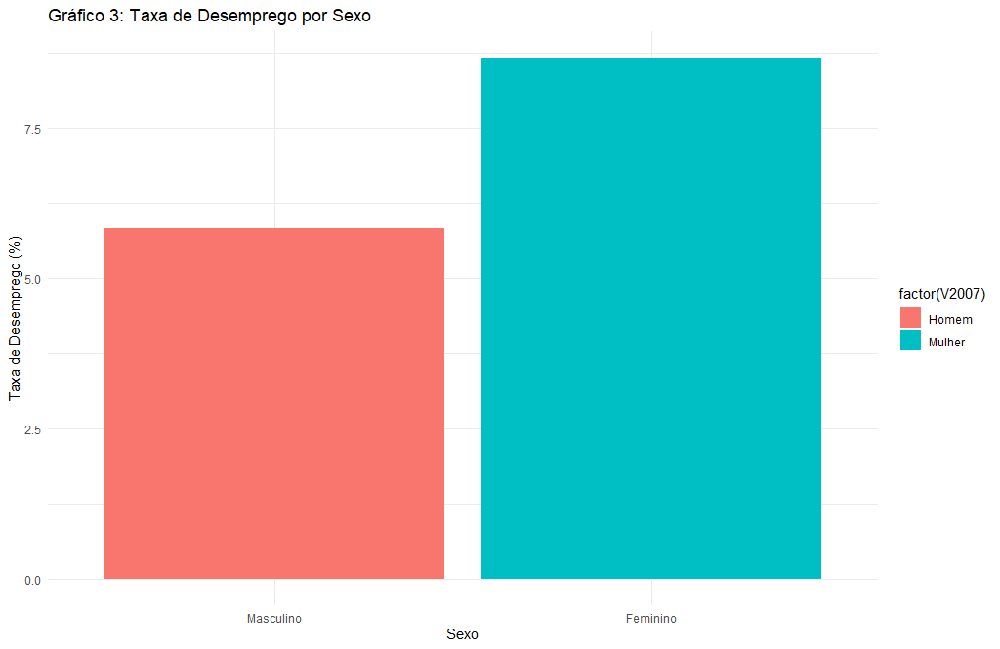
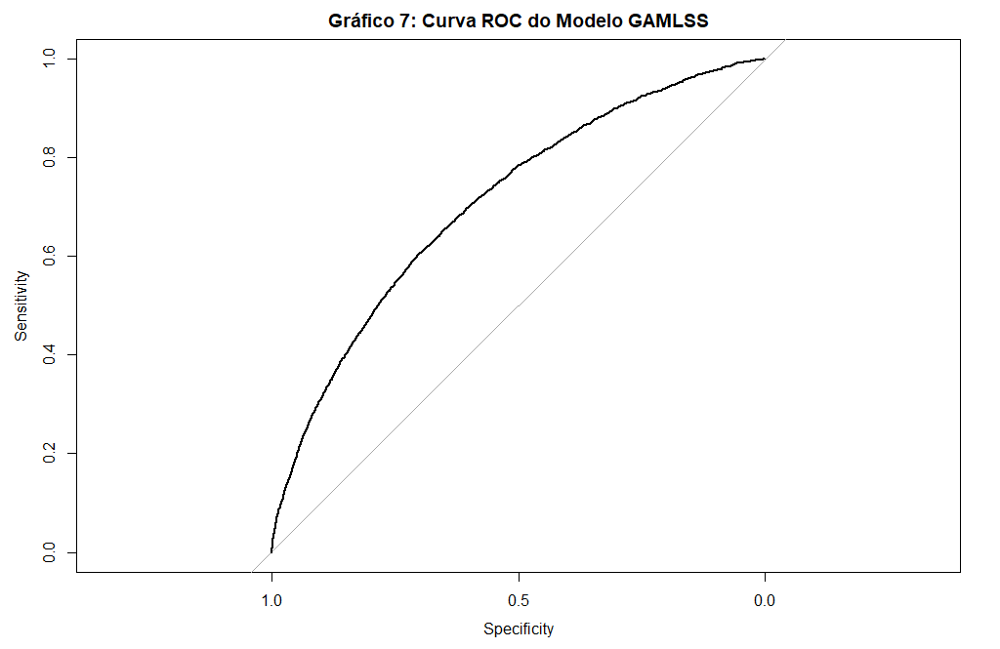

Modelo GAMLSS - Previsão de Desemprego
================
Mateus Vieira Costa

# Modelo GAMLSS para Análise e Previsão da Taxa de Desemprego

Este repositório contém o código de desenvolvimento do meu pré-projeto
de pesquisa para a disciplina de Tópicos em Estatística 2 do
Departamento de Estatística da Universidade de Brasília (UnB). O foco do
trabalho está na modelagem preditiva e análise da desocupação no Brasil
utilizando distribuições probabilísticas flexíveis aplicadas a dados
macroeconômicos oficiais.

## 🛠️ Tecnologias e Ferramentas Utilizadas

- **Linguagem:** R
- **Pacotes de Modelagem Avançada:** `gamlss` e `gamlss.dist`
- **Manipulação e Extração de Dados:** `PNADcIBGE`, `tidyverse`, `dplyr`
- **Validação Preditiva e Machine Learning:** `caret`, `pROC`

## 📊 Volume e Engenharia de Dados

O projeto envolveu o consumo direto de dados oficiais e tratamento de
uma base amostral robusta: \* Download, extração e tratamento de
**221.158 observações** referentes ao quarto trimestre de 2023 da PNAD
Contínua (IBGE). \* Filtragem rigorosa para manter na base apenas os
indivíduos pertencentes à **Força de Trabalho** (pessoas ocupadas ou
desocupadas na semana de referência). \* Recodificação binária da
variável target para adequação aos pressupostos de modelagem clássica e
generalizada.

## 🧠 Abordagem Estatística

Para contornar as limitations das regressões logísticas tradicionais
(que modelam apenas a média condicional e sofrem com sobredispersão ou
desbalanço severo de classes), foi implementada a metodologia dos
**Modelos de Local, Escala e Forma Generalizados (GAMLSS)**.

O desenho metodológico envolveu uma competição paramétrica entre três
famílias de distribuição concorrentes: 1. **GAMLSS Binomial (BI):**
Modelo baseline equivalente à regressão logística. 2. **GAMLSS
Beta-Binomial (BB):** Para capturar e corrigir a sobredispersão induzida
por fatores geográficos e regionais. 3. **GAMLSS Binomial
Zero-Inflacionada (ZIBI):** Para modelar de forma explícita a inflação
de zeros estrutural (alta proporção de pessoas ocupadas na força de
trabalho).

A seleção do modelo final baseou-se no Critério de Informação de Akaike
(**AIC**), e a validação preditiva foi realizada dividindo a base em
conjuntos independentes de treino (80%) e teste (20%) via pacote
`caret`.

## 📈 Resultados e Insights Principais

A modelagem final por meio da distribuição **ZIBI (Zero-Inflated
Binomial)** foi a que apresentou o melhor ajuste (menor AIC), permitindo
isolar o impacto das covariáveis demográficas e socioeconômicas sobre a
probabilidade de desocupação:

- **O Impacto Protetor da Instrução:** O nível de escolaridade
  mostrou-se o principal fator mitigador do desemprego. À medida que o
  grau de instrução avança, o risco condicional de desocupação decresce
  drasticamente, evidenciando o valor do capital humano no mercado
  formal.
- **Disparidades Estruturais de Gênero e Etnia:** O modelo confirmou
  desigualdades estatisticamente significantes na força de trabalho.
  Populações autodeclaradas pretas e pardas, bem como o gênero feminino,
  apresentaram chances significativamente maiores de desocupação,
  controlando-se pelas demais variáveis.
- **Ciclo de Vida e Vulnerabilidade Jovem:** A análise da variável idade
  apontou uma concentração severa do desemprego nos jovens em início de
  carreira, com a curva de risco decrescendo de forma não-linear à
  medida que a idade avança.
- **Excelente Capacidade de Discriminação Preditiva:** Avaliado em uma
  base de teste completamente independente, o classificador
  probabilístico GAMLSS demonstrou robustez e estabilidade, alcançando
  uma **AUC (Área Sob a Curva ROC) de 0.7082**, o que valida o uso do
  modelo para políticas preditivas de emprego.

### 📊 Análise Visual do Desemprego

Abaixo estão as principais visualizações extraídas da pesquisa,
refletindo os padrões descritivos e a performance do classificador:

#### Taxa de Desemprego por Sexo

#### Curva ROC do Modelo GAMLSS Final (Poder Preditivo)

⚠️ **Nota sobre Reprodutibilidade e Custo Computacional:** Os microdados
oficiais da PNAD Contínua contêm centenas de milhares de observações,
exigindo processamento intensivo de memória RAM para a convergência de
modelos GAMLSS com famílias complexas. Para garantir que o código
disponível neste repositório seja totalmente executável por qualquer
avaliador técnico sem travamentos locais, o script principal vem
configurado por padrão em **Modo de Demonstração**, gerando uma amostra
controlada sintética. Os gráficos exibidos nesta documentação (pasta
`/Plots`) são os originais e reais extraídos do relatório de pesquisa.

## 📁 Como Executar o Código

O script ponta a ponta contendo a ingestão de dados, análise descritiva,
separação de bases e ajuste das três famílias de modelos está localizado
no arquivo principal na raiz do repositório. Caso queira forçar a
execução real com os dados massivos do IBGE, basta alterar a flag
inicial para a leitura completa no código fonte.
